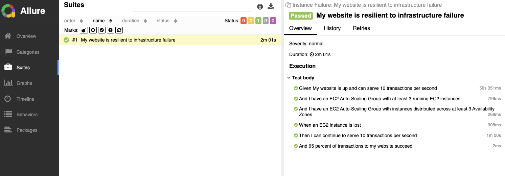

# Pre-requisites
Recent and working version of Python installed (i.e. 3.9 or later)
Stable internet connection - website availability tests are executed from your machine in the sample code used in this blog. If you are traversing a busy corporate proxy or a network connection that is not stable then it can impact the results.

> **recommended** - create a new, clean Python virtual environment somewhere and activate it
  
```shell
python3 -m venv behavefisvenv
source behavefisvenv/bin/activate
```

# Steps
To be carried out from the root of the repo:
1. Install the Python dependencies in the venv
    ```shell
    pip install -r requirements.txt
    ```
2. Create the test stack and wait for completion
    ```shell
    aws cloudformation create-stack --stack-name my-chaos-stack --template-body file://cloudformation/infrastructure.yaml --region=eu-west-1 --capabilities CAPABILITY_IAM

    aws cloudformation wait stack-create-complete --stack-name my-chaos-stack --region=eu-west-1
    ```

3. Behave User Params Setup
   ### Automated userconfig
   If you have ```jq``` installed you can run this to create a user config automatically or follow below to do it manually
    ```shell
    aws cloudformation describe-stacks --stack-name my-chaos-stack --region eu-west-1 | \
      jq -r '.Stacks[0] | {website_hostname: .Outputs[] | select(.OutputKey == "AlbHostname").OutputValue, fis_experiment_id: .Outputs[] | select(.OutputKey == "FisExperimentId").OutputValue}' > extracted-values.json && jq -s '.[0] + .[1]' behave/example-userconfig.json extracted-values.json > behave/userconfig.json
    ```

    ### Manual userconfig
    Get the stack outputs

    ```shell
    aws cloudformation describe-stacks --stack-name my-chaos-stack --region=eu-west-1
    ```
    - Copy the OutputValue of the stack Outputs for **AlbHostname** and **FisExperimentId** into the ```behave/userconfig.json```, replacing the placeholder values for website_hostname and fis_experiment_id respectively

    - Replace the region value in the behave/userconfig.json file with the region you built the stack in
4. paste AWS credentials into your environment (or make them accessible to boto in one of the usual ways)
5. change directory into behave/ directory
    ```shell
    cd behave/
    ```
6. execute behave: behave
    ```shell
    behave -f allure_behave.formatter:AllureFormatter -o .outputs
    ```
7. locust results will appear in the behave folder
8. at you CLI you should see output similar to 

9. (**Optional**) If you want to see a test report in Allure format, you can install allure on MacOS with 
    ```shell
    brew install allure
    ```
    And you can view the report with 
    ```shell
    allure serve .outputs
    ```
    

# Clean-up
To delete the stack run
```shell
aws cloudformation delete-stack --stack-name my-chaos-stack --region=eu-west-1 &&
aws cloudformation wait stack-delete-complete --stack-name my-chaos-stack --region=eu-west-1
```