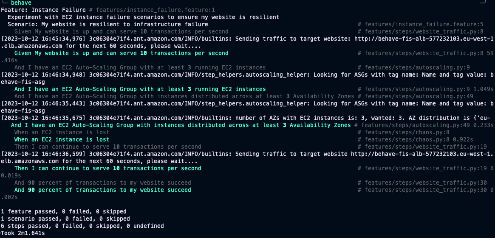

# Pre-requisites
Following this blog post will incur some costs for AWS services. To deploy the chaos experiment and test application you will need an [AWS account](https://aws.amazon.com/premiumsupport/knowledge-center/create-and-activate-aws-account/). We also assume that you are using [AWS CloudShell](https://console.aws.amazon.com/cloudshell/home) or have the AWS CLI [installed](https://docs.aws.amazon.com/cli/latest/userguide/getting-started-install.html) and have [configured](https://docs.aws.amazon.com/cli/latest/userguide/cli-configure-quickstart.html) a profile with administrator permissions.

Please ensure you have installed a recent and working version of Python (i.e. 3.9 or later).

Website availability tests are executed from your machine in the sample code used in this blog. If you are traversing a busy corporate proxy or a network connection that is not stable then it can impact the results.

# Environment preparation

Clone the git repository [aws-fis-behaviour-driven-chaos](https://github.com/aws-samples/aws-fis-behaviour-driven-chaos) that contains the blog resources using the below command:

    ```shell
    git clone https://github.com/aws-samples/aws-fis-behaviour-driven-chaos.git
    ```

> **recommended** - create a new, clean Python virtual environment somewhere and activate it

    ```shell
    python3 -m venv behavefisvenv
    source behavefisvenv/bin/activate
    ```

# Deployment Steps

To be carried out from the root of the repo:

1. Install the Python dependencies in the venv
    ```shell
    pip install -r requirements.txt
    ```
2. Create the test stack and wait for completion:
    ```shell
    aws cloudformation create-stack --stack-name my-chaos-stack --template-body file://cloudformation/infrastructure.yaml --region=eu-west-1 --capabilities CAPABILITY_IAM
    aws cloudformation wait stack-create-complete --stack-name my-chaos-stack --region=eu-west-1
    ```

3. Once the deployment reaches a create-complete state, retrieve the stack outputs: 

    ```shell
    aws cloudformation describe-stacks --stack-name my-chaos-stack --region=eu-west-1
    ```

4. Copy the OutputValue of the stack Outputs for **AlbHostname** and **FisExperimentId** into the ```behave/userconfig.json```, replacing the placeholder values for website_hostname and fis_experiment_id respectively

5.  Replace the region value in the ```behave/userconfig.json``` file with the region you built the stack in
6.  change directory into behave/
    ```shell
    cd behave/
    ```
7. execute behave:
    ```shell
    behave
    ```
8. Once execution completes, Locust results will appear inside the behave folder, output similar to the below will be shown at the CLI. 

# Clean-up
To delete the stack run
```shell
aws cloudformation delete-stack --stack-name my-chaos-stack --region=eu-west-1 &&
aws cloudformation wait stack-delete-complete --stack-name my-chaos-stack --region=eu-west-1
```